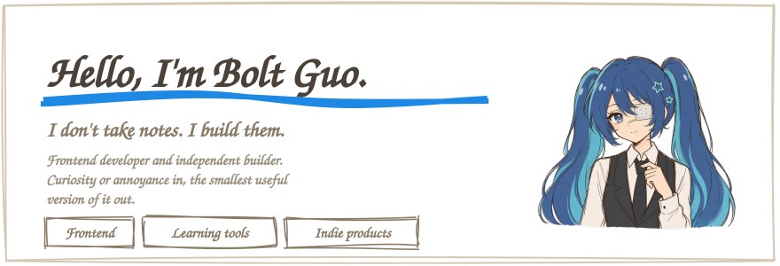
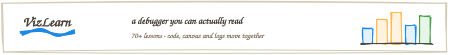
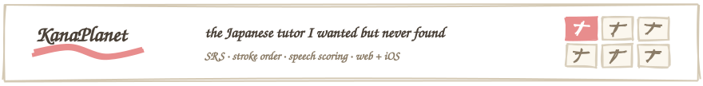
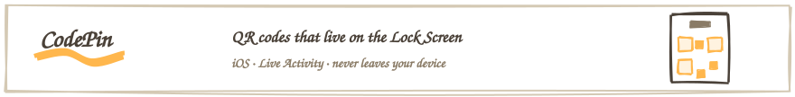
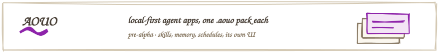
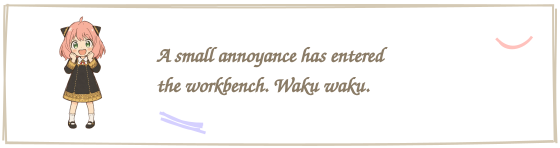

<!-- No badge wall here. The projects are the graph. -->
<!-- readme/*.svg are drawn by scripts/draw-readme-art.mjs — run `pnpm readme:art` to redraw. -->

  

## On the workbench

  
  
  
  

## Usually within reach

  

  
<b>Open the bottom drawer</b>

   
  Things that never earned their maintenance — deleted, no ceremony. 
  Things I rebuilt instead of reading about — most of this page. 
  Tabs still open from one idea last spring — please don't ask. 
  Away from the keyboard — games, anime, and making an already-long playlist even longer.

  

